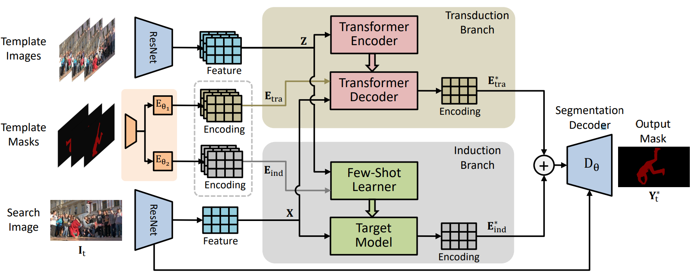

# JOINT
This is the official implementation of [Joint Inductive and Transductive learning for Video Object Segmentation](https://arxiv.org/pdf/2108.03679.pdf), to appear in ICCV 2021.
```
@inproceedings{joint_iccv_2021,
  title={Joint Inductive and Transductive Learning for Video Object Segmentation},
  author={Yunyao Mao, Ning Wang, Wengang Zhou, Houqiang Li},
  booktitle={Proceedings of the IEEE/CVF International Conference on Computer Vision (ICCV)},
  month = {October},
  year={2021}
}
```



## Installation

### Clone this repository 
```bash
git clone https://github.com/maoyunyao/JOINT.git
```

### Install dependencies
Please check the [detailed installation instructions](INSTALL.md).

## Training
The whole network is trained with 8 NVIDIA GTX 1080Ti GPUs
```bash
conda activate pytracking
cd ltr
python run_training.py joint joint_stage1  # stage 1
python run_training.py joint joint_stage2  # stage 2
```
**Note:** We initialize the backbone ResNet with pre-trained Mask-RCNN weights as in [LWL](https://arxiv.org/pdf/2003.11540.pdf). These weights can be obtained from [here](https://drive.google.com/file/d/12pVHmhqtxaJ151dZrXN1dcgUa7TuAjdA/view?usp=sharing). Before training, you need to download and save these weights in env_settings().pretrained_networks directory.

## Evaluation
```bash
conda activate pytracking
cd pytracking
python run_tracker.py joint joint_davis --dataset_name dv2017_val        # DAVIS 2017 Val
python run_tracker.py joint joint_ytvos --dataset_name yt2018_valid_all  # YouTube-VOS 2018 Val
python run_tracker.py joint joint_ytvos --dataset_name yt2019_valid_all  # YouTube-VOS 2019 Val
```
**Note:** Before evaluation, the pretrained networks (see [model zoo](#Model-Zoo)) should be downloaded and saved into the directory set by "network_path" in "pytracking/evaluation/local.py". By default, it is set to pytracking/networks.

## Model Zoo

### Models
|    Model    | YouTube-VOS 2018 (Overall Score) | YouTube-VOS 2019 (Overall Score) | DAVIS 2017 val (J&F score) | Links | Raw Results |
|:-----------:|:--------------------------------:|:--------------------------------:|:--------------------------:|:-----:|:-----------:|
|  [JOINT_ytvos](ltr/train_settings/joint/joint_stage2.py)  |               83.1               |               82.8               |              --             | [model](https://drive.google.com/file/d/1U48rlb1Xplb2CN2urwFtaB_o62B2Y4xo/view?usp=sharing) | [results](https://drive.google.com/drive/folders/15BO1vK-z8qdmU3KZ0V0KAbD7NEL_SUZ1?usp=sharing) |
|  [JOINT_davis](ltr/train_settings/joint/joint_stage2.py) |               --               |                 --                |            83.5            | [model](https://drive.google.com/file/d/1UB_gDc0LMg0yixIQmkxpAt2AMF4m9zRq/view?usp=sharing) | [results](https://drive.google.com/drive/folders/1BNbvTfrKar7TjQGcZqHha078MlDIRJh9?usp=sharing) |


## Acknowledgments
* Our **JOINT** segmentation tracker is implemented based on [pytracking](https://github.com/visionml/pytracking). We sincerely thank the authors Martin Danelljan and Goutam Bhat for providing such a great framework.
* We adopt the few-shot learner proposed in [LWL](https://arxiv.org/pdf/2003.11540.pdf) as the Induction branch.